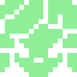
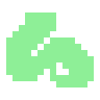
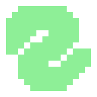

# 設定

まず最初に、フレームワークのコアノードについて知っておきましょう。Medusa は完全に Godot 標準の `Control` (UI) システムに基づいて構築されていますが、インターフェースをダイナミックで「生き生きとした」ものにするために、独自のデータ指向物理エンジンとレンダリングロジックを導入しています。

スキルツリーやインタラクティブなネットワークを作成するには、主に3つのノードを使用します。

---
## 1) Graph (セントラルコントローラー)

> 
> 
> **Graph** ノードはシステムの心臓部です。物理シミュレーションの空間、入力ハンドラー、および接続線を描画するためのキャンバスとして機能します。

!!! tip
    スキルツリーやネットワークは、親またはメインコンテナとして `Graph` ノードを持つ必要があります。これがすべての下位要素の動作を調整します。

- **物理エンジン:** リアルタイムのシミュレーション（重力、反発、バネ）を実行します。すべての計算は UI 要素向けに最適化されています。
- **境界とグリッド:** `Boundary & Grid` グループでは、`boundary_shape` (矩形、楕円、またはカスタム) を使用して要素の移動を制限できます。`Use Grid Snap` パラメータを使用すると、ドラッグ時にアトムをグリッドに「吸着」させることができます。
- **選択とフォーカス:** 現在選択されている要素やカーソル下の要素を管理します。Medusa は、`FocusSystem` パラメータを介してマウスとゲームパッドの両方のナビゲーションをサポートしています。
- **線の描画:** グラフはすべての接続を自動的にスキャンし、`GraphLine` リソースを使用して線を描画します。

!!! warning
    デフォルトでは枠線は表示されませんのでご注意ください。特定のスタイルを使用して枠線を定義する場合は、必ず `anchor_preset` を設定し、グラフのサイズを考慮してください。すべての要素が、この枠線の境界内に完全に収まるようにする必要があります。

### 基本設定:

1. **ラインスタイル:** `graph_lines` フィールドにリソースを割り当てます。既定のスタイルを使用するか、[GraphLine](../references/graph_lines/graph_lines.ja.md) を継承して独自のスタイルを作成できます。
2. **フォーカスシステム:** `Medusa` (定義済みのナビゲーションキーで動作するプラグイン独自システム) または `Godot` (空間分析に基づくエンジンの標準自動システム) を選択します。また、起動時に自動的にフォーカスされる `initial_focus_atom` を設定することもできます。
3. **複数選択:** `Selection Mode` (Solo/Multiple) でクリック時の挙動を設定します。複数選択の場合は、`multi_select_action` などの修飾アクションを指定します（アクションはプロジェクト設定のインプットマップで作成できます）。
4. **カーソル:** グラフ内ポインタが必要な場合は、`cursor_texture` フィールドを入力します。起動時、グラフは内部にテクスチャノードを作成します。コードからアクセスして、このコンポーネントを完全に制御できます。

### 物理挙動:
Medusa の物理は `Physics Forces` のリストに基づいて動作します。Medusa は標準的な物理挙動をプリセットとして提供しています。

安定した挙動のために、以下の順序で追加することをお勧めします：

1. **Inertia (慣性):** ノードに質量を与えます（重いノードは動かしにくくなります）。
2. **Repulsion (反発):** すべてのアトムを押し出し、重なりを防ぎます。
3. **ClusterRepulsion (クラスター反発):** 複雑な構造向けの特殊な力で、グラフの枝（ブランチ）全体を押し広げます。
4. **Spring (バネ):** 接続されたアトム間に「バネ」を作成し、特定の距離を保ちます。
5. **Gravity (重力):** アトムをグラフの中心または親ブランチの方へ引き寄せます。

タスクに応じて他の物理挙動を追加することも可能です（詳細は [Physics](../references/physics/physics.ja.md) を参照）。
それ以降の設定はシンプルで、各パラメータを微調整して特定の挙動を実現するだけです。

---
## 2) Atom (ネットワーク要素)

> 
> 
> **Atom** (アトム) ノードは、スキル、アイテム、技術、クエストなどの単一の機能単位を表します。

アトムは、円形の物理表現を持つダイナミックな `Control` ノードです。物理的なサイズは `radius` パラメータで決定され、視覚的なサイズはアイコンまたは `_draw` による描画で決定されます。

### アトムの接続
インスペクターでリンクを設定します：

- **Connected Paths:** 他のアトムへのパスのリスト。これにより物理的な接続（バネの力）と視覚的な線が作成されます。
- **Navigation Paths:** ボタンナビゲーション (`ui_up`, `ui_right` など) 用の隣接要素を定義する辞書。

### ステータスシステム
`status` パラメータはアトムの論理状態を定義します：

- `LOCKED`: ロック中。
- `AVAILABLE`: 取得/アンロック可能。
- `UNLOCKED`: 取得済み/アンロック済み。
- `HIDDEN`: 非表示（戦霧などで隠されている）。
- `DISABLED`: 永久に無効。

各ステータスは、アトムのパラメータまたはデータ (`AtomData`) で指定されたアクティブなアニメーションライブラリを切り替えます。

### アニメーションと状態
アトムの視覚的フィードバック（ホバー、プレス、選択）は **状態レジストリ** (`_state_registry`) を通じて管理されます。

!!! tip "技術的な詳細"
    アニメーションを設定するには：
    1. `AnimationPlayer` をアトムの一時的な子として追加します。
    2. `NORMAL`, `HOVER`, `PRESSED`, `FOCUSED` という名前でアニメーションを作成します。
    3. アニメーションライブラリ (`.tres` ファイル) を保存し、アトムのインスペクターにある対応するステータススロットに割り当てます（アニメーションプレイヤーの `libraries` パラメータからファイルシステムに保存してください）。
    4. 実行時、アトムは内部にプレイヤーを作成し、状態の変化に合わせて必要なアニメーションを再生します。

---
## 3) GraphBranch (グループ化とハブ)

> 
> 
> **GraphBranch** (ブランチ) ノードは、アトムのグループに対するローカルな重力ハブとして機能するコンテナです。

ツリー構造を整理するためにブランチを使用します：

- **ローカル重力:** ブランチ内のアトムは、グラフ全体の中央ではなく、ブランチの中心に引き寄せられます。
- **折りたたみ:** `collapse()` と `expand()` メソッドを使用すると、スキルブランチ全体をスムーズなアニメーションで表示/非表示にできます。
- **グループ移動:** `drag_branch_input` が有効な場合、ブランチの背景をドラッグすることでアトムのグループ全体を一度に移動できます。
